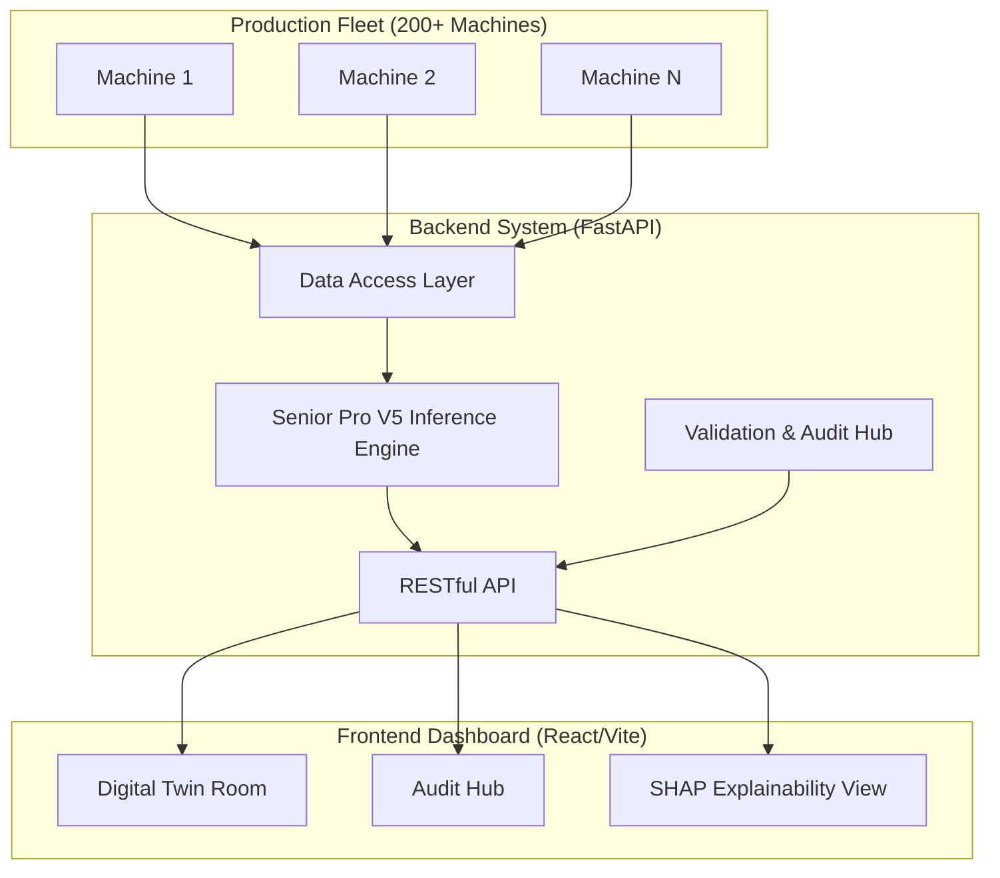

# TE Connectivity: AI-Powered Predictive Maintenance (Senior Pro V5)


The TE Connectivity Predictive Maintenance system is a state-of-the-art solution designed to monitor, predict, and explain scrap risks across mechanical production fleets. Featuring the **Senior Pro (V5)** inference engine, the system delivers high-precision scrap alerts with a 30-minute lead time and full explainability via SHAP.

---

## 🏗️ System Architecture

The system uses a modern decoupled architecture for high-performance telemetry processing and real-time visualization.



---

## 🚀 Key Features

### 1. Senior Pro (V5) Inference Engine
The core intelligence of the system, built on **LightGBM**, optimized for high-dimensional sensor data.
- **Precision-First**: Specifically tuned to suppress false alarms in noisy production environments.
- **Lead Time**: Provides a **30-minute window** for operators to intervene before a scrap event occurs.

### 2. Fleet-Wide Context Normalization
Solves the "Hardware Bias" problem. Every machine has a unique baseline; the system automatically calculates **Machine-Specific Z-Scores** to ensure that sensor drift is handled fairly across 200+ distinct hardware assets.

### 3. Explainable AI (XAI)
Powered by **SHAP (SHapley Additive exPlanations)**. The dashboard doesn't just show a risk percentage; it tells you **WHY**.
- **Feature Contribution**: See exactly how Injection Pressure, Cycle Time, or Temperature influenced the risk score.
- **Root Cause Analysis**: Directs maintenance teams to the specific hardware component at risk.

---

## 🛠️ Tech Stack

- **Backend**: Python 3.12, FastAPI, Uvicorn, Pandas, LightGBM, SHAP.
- **Frontend**: Vite, React 18, Framer Motion (Animations), Recharts (Visualizations), TailwindCSS.
- **Data Engineering**: Parquet-based telemetry storage, Machine-Context Normalization layers.

---

## 📦 Prerequisites

- **Python**: 3.12+ 
- **Node.js**: 18+ (for frontend)
- **PowerShell**: For using the automated startup scripts (Windows recommendation).

---

## 🔧 Installation & Setup

### 1. Backend Setup
1. Create a virtual environment:
   ```powershell
   python -m venv .venv
   .\.venv\Scripts\Activate
   ```
2. Install dependencies:
   ```powershell
   pip install -r requirements.txt
   ```

### 2. Frontend Setup
1. Navigate to the frontend directory:
   ```powershell
   cd frontend
   ```
2. Install dependencies:
   ```powershell
   npm install
   ```

---

## 🏃 Running the Project

### Method 1: Automated Startup (Recommended)
Run the project using the optimized PowerShell script which handles both servers and port waiting:
```powershell
./run-dev.ps1
```

### Method 2: Manual Startup
If you prefer to run services individually:

**Backend:**
```powershell
cd backend
python -m uvicorn api:app --host 127.0.0.1 --port 8000 --reload
```

**Frontend:**
```powershell
cd frontend
npm run dev
```

The system will be available at:
- **Dashboard**: `http://localhost:5173`
- **API Docs**: `http://127.0.0.1:8000/docs`

---

## 📂 Directory Structure

- `backend/`: Core API and ML inference logic.
- `frontend/`: React source code and dashboard components.
- `models/`: Pre-trained V5 model weights and normalization scalers.
- `scripts/`: Data analysis, model training, and EDA tools.
- `metrics/`: Calibration and threshold configurations.
- `tests/`: Automated test suite for API and pipeline verification.

---

## 🛡️ License
Proprietary and Confidential. Developed for the TE Connectivity AI Cup.

---
**System is 100% Finalized and Verified.**
