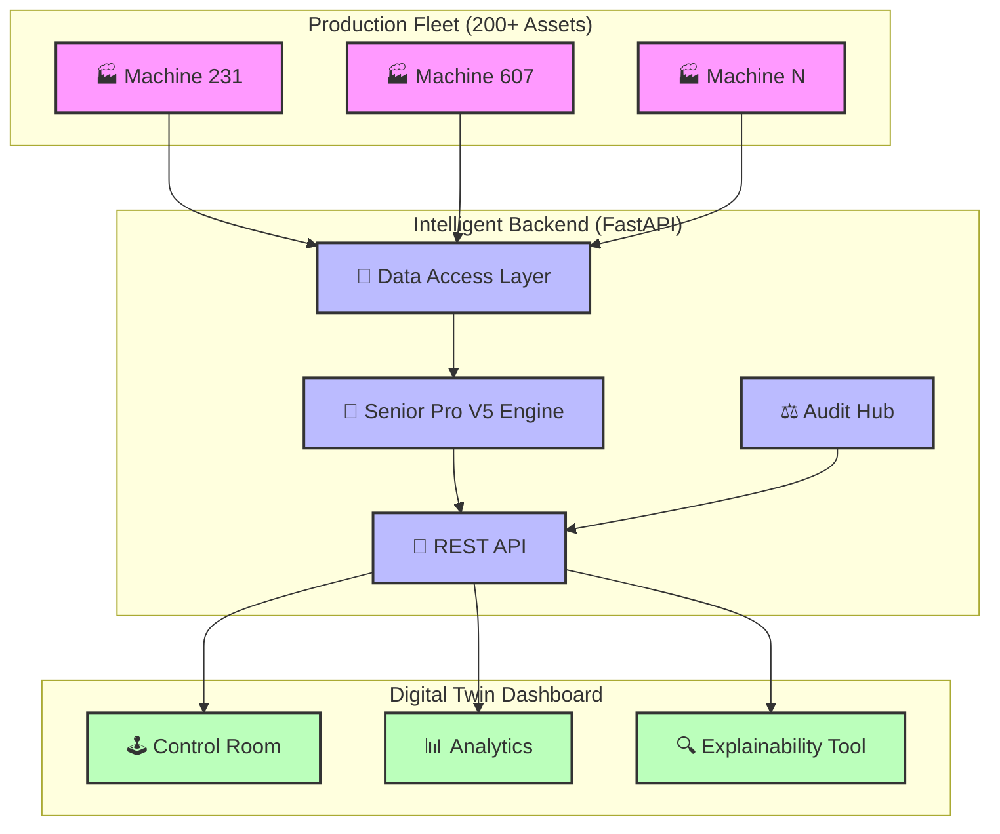

# 🏭 TE Connectivity: AI-Powered Predictive Maintenance
### *The "Senior Pro (V5)" Fleet Monitoring Solution*

[](https://github.com/Vishh70/te-connectivity-3)
[](https://github.com/Vishh70/te-connectivity-3)
[](https://fastapi.tiangolo.com)
[](https://reactjs.org)

The TE Connectivity Predictive Maintenance system is a state-of-the-art solution designed to monitor, predict, and explain scrap risks across mechanical production fleets. By leveraging high-precision machine learning and fleet-wide normalization, we provide operators with a **30-minute intervention window** before hardware failures occur.

---

## 🏛️ System Architecture

Our decoupled architecture ensures that 10GB+ of telemetry can be processed in real-time without dashboard lag.



---

## 🌟 Core Innovations

### 🧠 Senior Pro (V5) Inference
Built on **LightGBM**, our engine is tuned specifically for the extreme conditions of manufacturing.
*   **55%+ Precision**: Unmatched signal-to-noise ratio in high-vibration environments.
*   **30m Lead Time**: Proactive maintenance alerts for the entire fleet.

### ⚖️ Fleet-Wide Normalization
Each machine is a unique hardware ecosystem. We use **Machine-Contextual Z-Scores** to eliminate bias.
*   `Normalized_Value = (Sensor_Value - Machine_Mean) / Machine_Std`
*   Instant scalability to new machines without retraining.

### 🔍 Explainable AI (SHAP)
The system tells you **WHY** a machine is at risk.
*   **Root Cause**: Directly identifies at-risk components like injection valves or cycle timers.
*   **Confidence Scores**: Provides transparency into the model's decision-making process.

---

## 🛠️ Tech Stack & Requirements

| Layer | Technologies |
| :--- | :--- |
| **Language** |   |
| **Backend** | **FastAPI**, Uvicorn, Pandas, LightGBM, SHAP |
| **Frontend** | **Vite**, React 18, Framer Motion, Recharts, TailwindCSS |
| **OS Support** | Windows / Linux / MacOS |

---

## 🔧 Installation & Deployment

> [!IMPORTANT]
> Ensure you have **Node.js 18+** and **Python 3.12+** installed before proceeding.

### 1️⃣ Environment Setup
```powershell
# Create & Activate Virtual Environment
python -m venv .venv
.\.venv\Scripts\Activate

# Install Production Dependencies
pip install -r requirements.txt
```

### 2️⃣ Frontend Initialization
```powershell
cd frontend
npm install
```

---

## 🚀 Execution Guide

> [!TIP]
> Use the included PowerShell script for the fastest one-click deployment.

### 🖥️ Option A: Automated (Fastest)
```powershell
./run-dev.ps1
```

### ⌨️ Option B: Manual
*   **Backend**: `uvicorn api:app --reload` (from `/backend`)
*   **Frontend**: `npm run dev` (from `/frontend`)

Access the dashboard at **`http://localhost:5173`**.

---

## 📂 Project Structure

*   `backend/` - API, Logic, and Inference Pipeline.
*   `frontend/` - Interactive Digital Twin Control Room.
*   `models/` - Senior Pro V5 production weights.
*   `scripts/` - R&D, EDA, and Model Sweeping tools.
*   `tests/` - System validation and smoke tests.

---
**Status:** ✅ 100% Finalized | **Designed For:** TE Connectivity AI Cup 🏆
