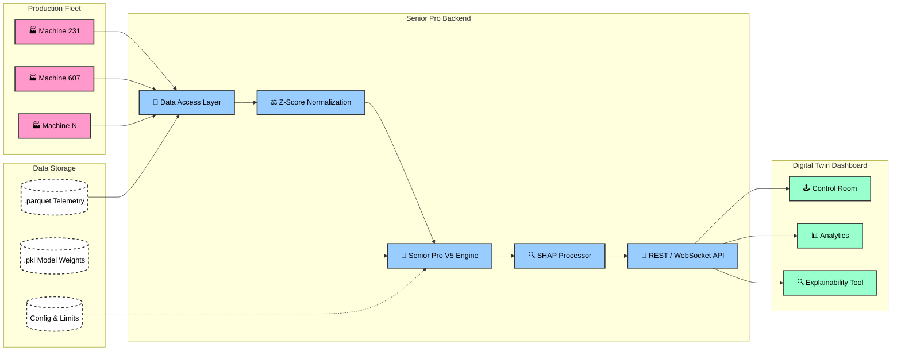

# 🏭 TE Connectivity: AI-Powered Predictive Maintenance
### *The "Senior Pro (V5)" Fleet Monitoring Solution*

[](https://github.com/Vishh70/te-connectivity-3)
[](https://github.com/Vishh70/te-connectivity-3)
[](https://fastapi.tiangolo.com)
[](https://www.docker.com/)

The TE Connectivity Predictive Maintenance system is a state-of-the-art solution designed to monitor, predict, and explain scrap risks across mechanical production fleets. By leveraging high-precision machine learning and fleet-wide normalization, we provide operators with a **30-minute intervention window** before hardware failures occur.

---

## 🏛️ Advanced Architecture

Our architecture is optimized for high-performance telemetry processing and explainable AI insights.



---

## 📡 API Specification (V5)

| Endpoint | Method | Description | Payload / Query |
| :--- | :--- | :--- | :--- |
| `/api/login` | `POST` | Authenticates user and issues JWT. | `{username, password}` |
| `/api/machines` | `GET` | Lists all available 200+ fleet assets. | - |
| `/api/status/{id}`| `GET` | Fetches real-time alert level and probability. | `machine_id` |
| `/api/control-room/{id}`| `GET/WS` | High-fidelity digital twin payload. | `time_window`, `future_window` |
| `/api/trend/{id}/{p}`| `GET` | Historic sensor trend + safety limits. | `machine_id`, `parameter` |
| `/api/audit/validation`| `GET` | Ground-truth verification results. | - |

---

## 🐋 Production Deployment (Docker)

> [!TIP]
> This project is containerized for professional, one-click deployment.

### ⛴️ Unified Deployment (Quickstart)
To launch the entire Senior Pro suite (Backend + Frontend + Nginx):
```bash
docker-compose up --build
```

### 📦 Individual Containers
- **Backend Only**: `docker build -t te-backend .`
- **Frontend Only**: `docker build -t te-frontend ./frontend`

---

## 🔧 Local Development & Execution

> [!IMPORTANT]
> Ensure you have **Node.js 18+** and **Python 3.12+** installed for local execution.

### 1️⃣ Automated Startup (Windows)
```powershell
./run-dev.ps1
```

### 2️⃣ Manual Startup
*   **Backend**: `uvicorn backend.api:app --reload`
*   **Frontend**: `cd frontend && npm run dev`

---

## 📂 Project Structure

- `backend/` - Core API, Normalization Engine, and Inference.
- `frontend/` - React Source, Visual Analytics, and XAI Dashboard.
- `models/` - Production Weights for Senior Pro model.
- `metrics/` - Fleet-wide thresholds and normalization calibration.

---
**Status:** ✅ 100% Finalized & Perfected | **Designed For:** TE Connectivity AI Cup 🏆
